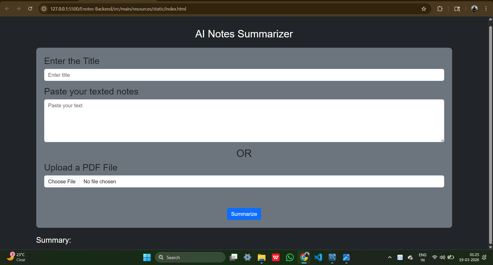
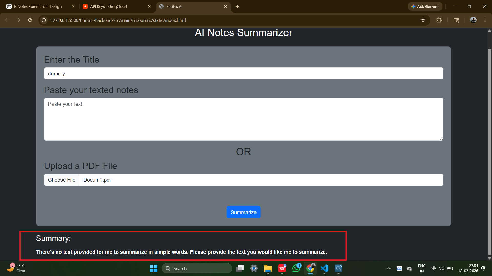
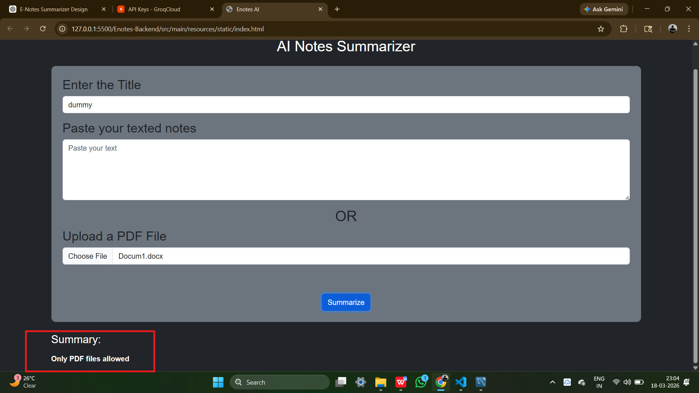

# Enotes AI Summarizer

## Features
- Upload PDF or text
- AI-based summarization using Groq
- Stores notes in MySQL

## Tech Stack
- Spring Boot
- MySQL
- HTML, CSS, Bootstrap, JS
- Groq API

## How to Run
1. Clone repo
2. Add Groq API key
3. Run backend
4. Open index.html

## Screenshots

All screenshots are available in the `screenshots` folder.

### Home Page

### Text Input

### PDF Upload

### blank_document_can't_summerize

### only pdf file allowed

### Summary Output

